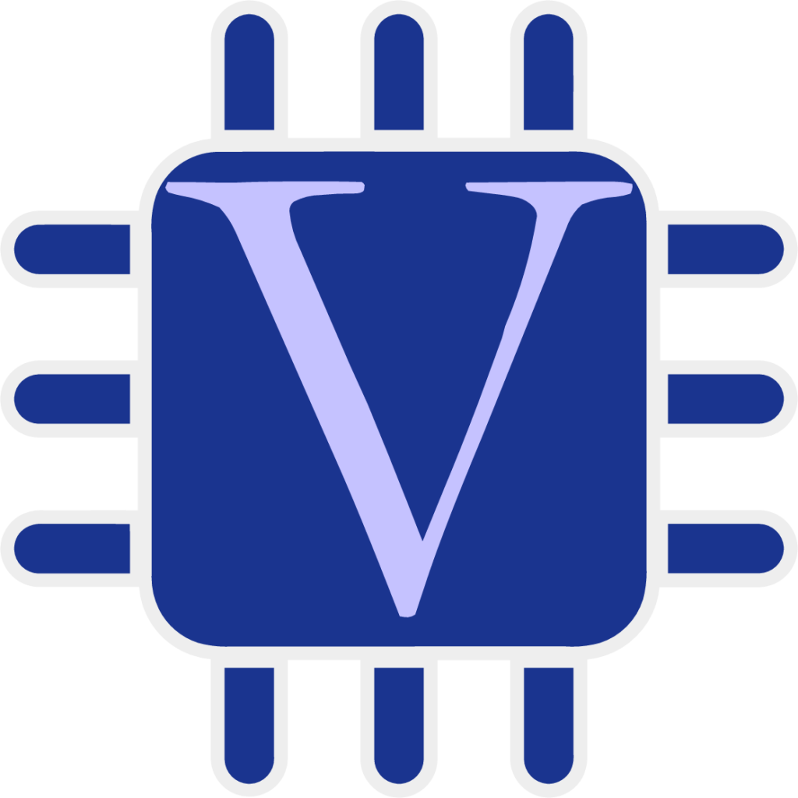

### Hey there 


<a href="https://www.linkedin.com/in/duc-huy-nguyen-242a69163/">
  
</a>

<a href="https://www.researchgate.net/profile/Duc-Nguyen-162">
  
</a>

<a href="https://orcid.org/0000-0003-0216-2946">
  
</a>

<br>

<br>Hi, I'm [Huy (Duc Huy Nguyen)](https://www.linkedin.com/in/duc-huy-nguyen-242a69163/), a passionate self-taught AI developer and a Software engineer from Vietnam.
I received the B.S. degree from the Department of Electrical and Electronic Engineering, Danang University of Science and Technology, Danang, Vietnam, in 2017, and the M.S. and Ph.D. degrees from the Department of Electrical Engineering and Computer Science, National Yang Ming Chiao Tung University (NYCU), Hsinchu, Taiwan, in 2019 and 2022, respectively. 
My current research interests focus on researching and developing biomedical signal processing techniques using data science methodologies, machine learning, deep learning architectures and integrated circuit design.

My passion for AI and software lies with applying for Digital IC Design, Firmware for Biomedical & Hand-held Device and IoT. 
I take great care in the experience, architecture, and code quality of the things I build.

I am also an open-source enthusiast and maintainer. I learned a lot from the open-source community and I love how collaboration and knowledge sharing happened through open-source.


  
  
- 💬 Ask me about anything, I am happy to help;
- 📫 If you have any questions or comments, please feel free to contact me at ndhuyvn1994@gmail.com or ndhuyvn1994@nycu.edu.tw
- 📝 [Personal Site](https://sites.google.com/view/ndhuyvn)
- 🎓[Digital IC Design Note and Lecture by myself](https://hackmd.io/@XxYeQeXdTWGqk-BuR80UPQ/rkn7mNata)

  
**Languages and Tools:**  

<code></code>
<code></code>
<code></code>
<code></code>
<code></code>
<code></code>


📊 **My experience :** 🏆
<!--START_SECTION:waka-->
- **Working Experiences**
```text
Digital IC Design         3 years     █████████████████▒░░░░░░░░░░░
AI Algorithms(ML/DL)      5 years     ███████████████████████░░░░░░  
Data Science              3 years     █████████████████▒░░░░░░░░░░░
```

- **Programming Language**
```text
Verilog                   3 years     █████████████████▒░░░░░░░░░░░
Python                    5 years     ███████████████████████░░░░░░   
Matlab                    5 year      ███████████████████████░░░░░░    
C & C++                   3 years     █████████████████▒░░░░░░░░░░░    
```
- **Database Language**
```text
MySQL                     3 years     █████████████████▒░░░░░░░░░░░ 
MongoDB                   0.5 years   ███████▒░░░░░░░░░░░░░░░░░░░░░
```


📊 **This Week I Spent My Time On:**
<!--START_SECTION:waka-->
```text
No Activity tracked this Week
```
<!--END_SECTION:waka-->


📈 My GitHub Stats


